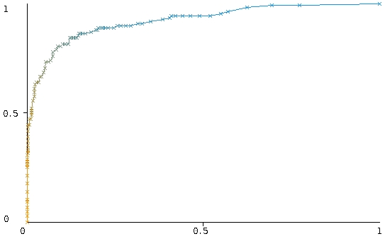
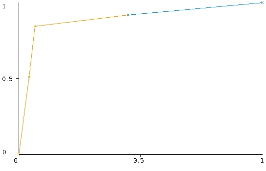

```{r}
#Copyright (c) 2018 Jouke Profijt.
#Licensed under GPLv3. See LICENSE
```


```{r setup, include=FALSE}
knitr::opts_chunk$set(echo = TRUE,
tidy.opts=list(width.cutoff=60),tidy=TRUE)
```

```{r}

BirdBones <- read.csv("../data/bird.csv",header = T, sep = ",")
#respective collums for the lenght and diameter
length <- c(2,4,6,8,10)
diameter <- c(3,5,7,9,11)
```

# Introduction
# Research Question
   What bone or group of bones that most birds have in common, is the most significant for the function in the diffrent ecological groups?
    
## Data
    Data recieved from:
    
[Birds' Bones and Living Habits, Kaggle dataset](https://www.kaggle.com/zhangjuefei/birds-bones-and-living-habits)
    
    Bone measurements were measured from a skeleton collection of
    Natural History Museum of Los Angeles County, 
    provided by Dr. D. Liu of beijing Museaum of Natural History
    
# Exploratory Data Analyses
The data contains 420 bird samples where the bone lengths and diameters have been measured. 
The birds are separated in 6 diffrent groups:

  * Swimming Birds, SW 
  * Wading Birds, W 
  * Terrestrial Birds, T 
  * Raptors, R 
  * Scansorial Birds, P 
  * Singing Birds, SO 

Most samples have data for:

  * Length and Diameter of the Humerus
  * Length and Diameter of the Ulna
  * Length and Diameter of the Femur
  * Length and Diameter of the Tibiotarsus
  * Length and Diameter of the Taesometatarsus


I'm creating a graph which displays the bonelengths on y axis an the Id on x colorcoded by their ecological group. by evaluating this we can see if some groups have overall larger or smaller bones and we see if there are big outliers.

```{r}
# this omits several ggplot2 errors retaining to mising values
BirdBones.noNA <- BirdBones[complete.cases(BirdBones),]
# Displaing the data frame structure and a small summary
str(BirdBones)
summary(BirdBones)
```

there are 420 total measurements, and by using complete cases i found that there are 413 measurements which are complete and do not contain missing values, aka > there are 7 measurements that contain missing values.

```{r}
library(ggplot2)
library(reshape)
source("../scripts/BoneMeans.R")
BirdBones.noNA <- BoneMeans(data = BirdBones.noNA, length = length, diameter = diameter)
ggplot(data = BirdBones.noNA, aes(id, length.mean, colour = type)) +
  ggtitle("Bone lenghts per Ecological group")+
  ylab("Mean lenght of total bird bones in mm") +
  xlab("Bird Sample")+
  geom_point()
```
As seen above swimming birds have the biggest bones, but also shown is that there are a lot more samples in that group where there is a lot of variation. I can look into cleaning up the data and removing the biggest outliers in this group. Singing birds also have a lot of samples but there is much less variation and so more certanty. 

For the rest of the birds there are not a lot of sample so maby we could try and normalizing the data so there is an even amount of samples per group.

There are also 7 samples that contain missing values, we could just straight out not use these samples becouse 4 of these are part of the biggest group of samples. and the others are not part of the smallest groups.

```{r}
library(ggplot2)

ggplot(stack(BirdBones.noNA[length]), aes(x = ind, y = values, color = ind)) +
  geom_boxplot()+
  ggtitle("Boxplot for bone lenghts per bone in mm")+
  xlab("Bone Type")+
  ylab("Length in mm")

ggplot(stack(BirdBones.noNA[diameter]), aes(x = ind, y = values, color = ind)) +
  geom_boxplot()+
  ggtitle("Boxplot for bone diameter per bone in mm")+
  xlab("Bone Type")+
  ylab("diameter in mm")
```

What we see above is that there are a considerable amount of outliers between the bones themselves, but this was expected as they are from diffrent groups and the diffrent groups dont have the same amount of measurements. below i will do a comparison between the group bone mean lengths which will show outliers in their respective group. using the above boxplots we can maby see which bones are not very important > see if they don't differ at all wich means we dont need them that much for classification.

As we can see the femur lenght and taesometatarsus length do not contain a lot of variation and maby are candidates for exclution from analysis.

```{r}
# diameter & lenght indexes for only the longer bones.
length.long <- c(2, 4, 8)
diameter.long <- c(3, 5, 9)
BirdBones.noNA.long <- BoneMeans(BirdBones.noNA, length.long, diameter.long)

```

```{r}
library(ggplot2)

ggplot(BirdBones.noNA.long, aes(x = type, y = length.mean, color = type)) +
  geom_boxplot()+
  coord_flip()+
  ggtitle("Boxplot for each ecological group's mean bone lenght")+
  ylab("Mean bone lenght in mm")+
  xlab("ecological group")
```

As you can see there are quite a few outliers in all groups except in group R, The raptors. but we saw in the above boxplot that there were loads of outliers between all bones, yet here that is significantly reduced. so if we are going to inspect the date we have to look at them per group and NOT by bone type.

What we can also see in these plots are which birds are most likely the largest, as seen above color cyan or SW or Swimming Birds are the biggest of them all closely followed by W or Wading Birds
```{r}
ggplot(BirdBones.noNA,aes(x=length.mean,y=diameter.mean,color=type))+
  geom_point()+
  geom_smooth()+
  ggtitle("mean lenght vs mean diameter")+
  xlab("Mean Lenght")+
  ylab("Mean Diameter")
```

Untransformed datapoints separated by goup, again here we can see which birds are the biggest, but for smaller birds this plot is not very readable. we do see something odd, where T has a climbing line around lenght 50, other birds have a decreasing line. also Swimming Birds have some results that are very diffrent form their mean line.


```{r}
ggplot(BirdBones.noNA.long,aes(x=length.mean,y=diameter.mean,color=type))+
  geom_point()+
  geom_smooth()+
  ggtitle("mean lenght vs mean diameter For Humerus, Ulna and Tibiotarsus")+
  xlab("Mean Lenght")+
  ylab("Mean Diameter")
```
```{r}
BirdBones.noNA.long$log2length <- log2(BirdBones.noNA.long$length.mean)
BirdBones.noNA.long$log2diameter <- log2(BirdBones.noNA.long$diameter.mean)

library(ggplot2)
ggplot(BirdBones.noNA.long, aes(x = log2length, y = log2diameter)) +
  geom_point()+
  geom_smooth(method = lm)+
  ggtitle("Log2 transformed Corelation between bone diameter & bone length")+
  xlab("Mean bone lenght")+
  ylab("Mean bone diameter")
```
As expected there is a coralation between the bone lenght and bone diameter, you can see this because the plot gives a liniar line.
it does make a lot of sense if you have longer bones there you will most likely also have thicker bones(bigger diameters)

We can also see a couple of outliers in the scatter plot above. we can try and isolate these samples and take a closer look.

```{r}


ggplot(BirdBones.noNA.long,aes(x=log2length,y=log2diameter,color=type))+
  geom_point()+
  ggtitle(" Log2 transformed mean lenght vs mean diameter For Humerus, Ulna and Tibiotarsus")+
  xlab("Mean Lenght")+
  ylab("Mean Diameter")
```
Same plot as above but colorcoded so we can see to which group the outliers belong.


```{r}
# m <- as.matrix(BirdBones.noNA$length.mean, ncol=2)
# 6 groups so 6 clusters is assumed
# cl <- kmeans(m, 6)
# 
# ```
# ```{r}
# BirdBones.noNA$cluster <- factor(cl$cluster)
# centers <- as.data.frame((cl$centers))
# ```
# ```{r}
# library(ggplot2)
# 
# 
# ggplot(data=BirdBones.noNA, aes(x=length.me43an, y=id, color=type )) + 
#  geom_point() + 
#  geom_point(data=centers, aes(x=V1,y=V2, color='Center')) +
#  geom_point(data=centers, aes(x=V1,y=V2, color='Center'), size=50, alpha=.4, legend=FALSE)
```
```{r}
library(ggplot2)
library(pheatmap)
df.hum <- data.frame(BirdBones.noNA$huml, BirdBones.noNA$humw)
kmeans.hum <- kmeans((df.hum), 6)

dm.len <- data.matrix(BirdBones.noNA[length])
dm.dia <- data.matrix(BirdBones.noNA[diameter])

pheatmap(dm.len, kmeans_k = 6)
pheatmap(dm.dia, kmeans_k = 6)
plot(kmeans.hum$cluster)
plot(kmeans.hum$centers)
```

For data cleaning we already have a dataset without NA's(BirdBones.NoNA). now we need to remove the found outliers and discard the unneeeded bones.

```{r}
huml.3rd.q <- 90.31
huml.1st.q <-25.17

out <- huml.1st.q - 1.5*(huml.3rd.q - huml.1st.q)
out.large <- huml.3rd.q + 1.5*(huml.3rd.q - huml.1st.q)
outliers <- subset(BirdBones.noNA, huml > out.large | huml < out)
Birdbones.Clean <- BirdBones.noNA[! BirdBones.noNA$id %in% outliers$id, ]


```

```{r}
summary(Birdbones.Clean)
```

```{r}
long.bones <- c(1, 2,3, 4,5,8,9, 12)
Birdbones.Clean <- Birdbones.Clean[,long.bones ]
```
```{r}

write.csv(Birdbones.Clean, "../data/CleanData.csv")
```

After creating the csv file im going to use weka to create an arff, i know there is a write.arff function but i can't get that to install properly.
\newpage

# Weka Analysis

For this classification we want the accuracy to be as high as possible, as wrongly classified fossils dont have that big of an impact as if someones health is on the line. 

Using ZeroR We get 30% guessed correctly. It looks for the values with the largest sample count which is SO and guesses that its most likely that any bird is that bird. Zero R : Zero Rules.

ZeroR predicts class value: SO


  * Correctly Classified Instances         124               30.6931 %

  * Incorrectly Classified Instances       280               69.3069 %

=== Confusion Matrix ===

   a   b   c   d   e   f   <-- classified as
   0   0   0   0   0 108 |   a = SW
   0   0   0   0   0  63 |   b = W
   0   0   0   0   0  23 |   c = T
   0   0   0   0   0  48 |   d = R
   0   0   0   0   0  38 |   e = P
   0   0   0   0   0 124 |   f = SO
   
Using One R without any changes gives a model that is overfitted. what i would want from one R is 6 diffrent classifiers each for 1. With a default bucket size of 6 we get 15 diffrent classiefiers.

with bucket size 12 we get 7 classiefiers, and 15 we get 3.

=== Confusion Matrix ===

   a   b   c   d   e   f   <-- classified as
  70  10   0  14   8   6 |   a = SW
  24  13   1  10  11   4 |   b = W
   1   7   5   2   5   3 |   c = T
  23   8   0  11   6   0 |   d = R
   0   5   4   1  14  14 |   e = P
   0   1   3   0  12 108 |   f = SO


One R with bucket size 11 seems to give us 6 diffrent classiefiers which is what i want. But the accuracy of the One R model is not very high. 

One R Classiefier model with bucket size 11 

huml: 

	  < 29.71	-> SO 
	  < 34.31	-> T  
	  < 45.64	-> P  
	  < 108.105	-> SW 
	  < 126.94	-> R  
	  >= 126.94	-> SW 
	  
Correctly Classified Instances         208               51.4851 %  
Incorrectly Classified Instances       196               48.5149 %  


=== Confusion Matrix ===

   a   b   c   d   e   f   <-- classified as
  69  11   1  10   8   9 |   a = SW
  35   2   4   4  10   8 |   b = W
   4   1   4   2   8   4 |   c = T
  29   5   1   6   6   1 |   d = R
   5   0   7   0  16  10 |   e = P
   2   0   3   0  10 109 |   f = SO

We get a lower accuracy but from the first run we were sure that the rule was overfitted

Next i tried Naive Bayes but it has almost the same result and not a lot of options to change:

Correctly Classified Instances         209               51.7327 %
Incorrectly Classified Instances       195               48.2673 %

With using Random.Forest i have done 3 diffrent runs, Becouse this accuracy is already much higher than the one & zero R performance. one with 10 max depht, 15 max depht and 20 max depht.


Simple logistic also gives promising results with default settings:

Correctly Classified Instances         304               75.2475 %
Incorrectly Classified Instances       100               24.7525 %

=== Confusion Matrix ===

   a   b   c   d   e   f   <-- classified as
  78  17   2   5   0   6 |   a = SW
  24  33   0   0   0   6 |   b = W
   0   0  11   3   8   1 |   c = T
   4   3   0  35   5   1 |   d = R
   0   6   1   1  25   5 |   e = P
   0   0   1   1   0 122 |   f = SO
   
   
SMO with default settings gives very close results to One R:

Correctly Classified Instances         217               53.7129 %
Incorrectly Classified Instances       187               46.2871 %

=== Confusion Matrix ===

   a   b   c   d   e   f   <-- classified as
  94   0   0   0   0  14 |   a = SW
  41   0   0   0   0  22 |   b = W
   7   0   0   0   0  16 |   c = T
  41   0   0   0   0   7 |   d = R
   9   0   0   0   0  29 |   e = P
   1   0   0   0   0 123 |   f = SO
   

Nearest neighbour IBk gives very promising results and we might look into the future:

Correctly Classified Instances         336               83.1683 %
Incorrectly Classified Instances        68               16.8317 %


=== Confusion Matrix ===

   a   b   c   d   e   f   <-- classified as
  91   8   0   4   0   5 |   a = SW
  12  44   1   1   3   2 |   b = W
   0   1  16   2   2   2 |   c = T
   2   1   0  43   0   2 |   d = R
   0   0   1   1  28   8 |   e = P
   6   1   0   1   2 114 |   f = SO

j48 with default settings gives us medioker results and mighnt not be very interesting to use in the future:


Correctly Classified Instances         271               67.0792 %
Incorrectly Classified Instances       133               32.9208 %

=== Confusion Matrix ===

   a   b   c   d   e   f   <-- classified as
  68  23   2  11   1   3 |   a = SW
  18  30   2   4   4   5 |   b = W
   3   3  11   1   1   4 |   c = T
   8   5   0  31   3   1 |   d = R
   1   2   4   2  23   6 |   e = P
   5   4   5   1   1 108 |   f = SO


Tester:     weka.experiment.PairedCorrectedTTester -G 4,5,6 -D 1 -R 2 -S 0.05 -result-matrix "weka.experiment.ResultMatrixPlainText -mean-prec 2 -stddev-prec 2 -col-name-width 0 -row-name-width 25 -mean-width 2 -stddev-width 2 -sig-width 1 -count-width 5 -print-col-names -print-row-names -enum-col-names"
Analysing:  Percent_correct
Datasets:   1
Resultsets: 8
Confidence: 0.05 (two tailed)
Sorted by:  -
Date:       10/6/18, 7:59 PM


Dataset                   (1) rules.Ze | (2) rules (3) trees (4) trees (5) funct (6) funct (7) bayes (8) lazy.
--------------------------------------------------------------------------------------------------------------
CleanData                (100)   30.69 |   53.39 v   66.84 v   79.14 v   74.54 v   53.52 v   50.67 v   83.32 v
--------------------------------------------------------------------------------------------------------------
                               (v/ /*) |   (1/0/0)   (1/0/0)   (1/0/0)   (1/0/0)   (1/0/0)   (1/0/0)   (1/0/0)


Key:
(1) rules.ZeroR '' 48055541465867954
(2) rules.OneR '-B 11' -3459427003147861443
(3) trees.J48 '-C 0.25 -M 2' -217733168393644444
(4) trees.RandomForest '-P 100 -I 100 -num-slots 1 -K 0 -M 1.0 -V 0.001 -S 1 -depth 15' 1116839470751428698
(5) functions.SimpleLogistic '-I 0 -M 500 -H 50 -W 0.0' 7397710626304705059
(6) functions.SMO '-C 1.0 -L 0.001 -P 1.0E-12 -N 0 -V -1 -W 1 -K \"functions.supportVector.PolyKernel -E 1.0 -C 250007\" -calibrator \"functions.Logistic -R 1.0E-8 -M -1 -num-decimal-places 4\"' -6585883636378691736
(7) bayes.NaiveBayes '' 5995231201785697655
(8) lazy.IBk '-K 1 -W 0 -A \"weka.core.neighboursearch.LinearNNSearch -A \\\"weka.core.EuclideanDistance -R first-last\\\"\"' -3080186098777067172

So from our experimentation with diffrent classification algorithems we conclude that Random.Forest and IBk ran the best of them all.


### Random.Forest

  First i have changed the max depth value and tested 10, 15, 20. in this testing using the experimenter i concluded that a max depth of 15 gives the best results.
  
Trees.Ra(Max 10) : 78.85%

Trees(Max 15)    : 79.14%

Trees(Max 20)    : 79.09%

Changing other settings only gives worse results.

### IBk, Nearest Neigbour

  It seems that it doesn't really matter what settings are used for this algoreithem as it gives them all the same accuracy. and if accuracy is the only metric we really want to maximize we can use default settings.
  \newpage
  
```{r}

```




  
